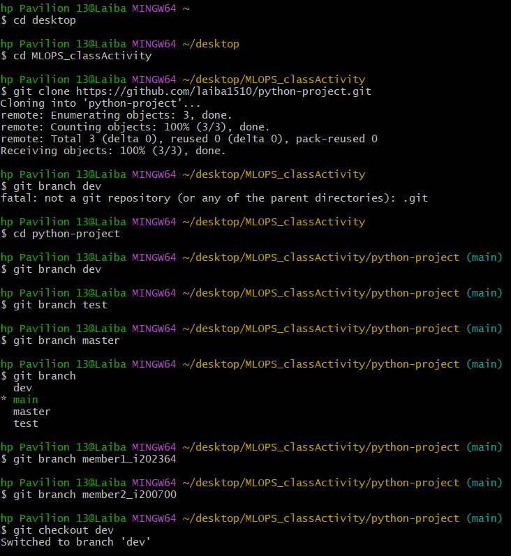

# City Time Checker

This Python script allows you to check the current time in different cities around the world.

## Requirements

- Python 3.x
- tkinter library
- pytz library

## Usage

1. Ensure you have Python installed on your system.
2. Install the required libraries using `pip install tkinter pytz`.
3. Run the script.
4. You will be prompted to choose a city from Karachi, Delhi, or Toronto using a dialog box.
5. The script will then display the current time for the chosen city.

## Authors

- Bismah
- Laiab

## License

This project is licensed under the BL_SLEFT (Be Like SLEFT) License. 
